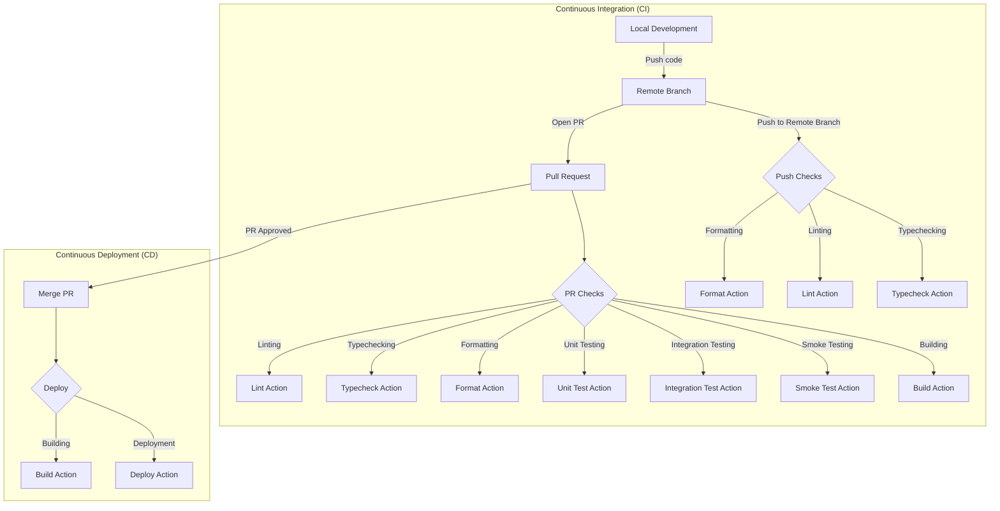

## Setup

### Build and run the project

```bash
$ docker compose build
```

### Run the project

```bash
$ docker compose up
```

## CI / CD

### Workflows

#### Push Workflow
This workflow is triggered on every push to a branch that is not main.
It's designed to be quick and provide immediate feedback to developers.
It runs lightweight checks such as linting and formatting, and can automatically fix and commit certain types of issues. This ensures that the code in all branches follows the same coding standards and prevents "fix lint" or "fix formatting" commits from cluttering the commit history.

#### Pull Request Workflow
This workflow is triggered when a pull request is opened or updated.
It runs a full suite of checks and tests to ensure that the changes are safe to merge.
More extensive checks are run in this workflow, as it's the last line of defense before the changes are merged into the main branch. However, automatic fixes should generally not be applied in this workflow, as they could potentially introduce unexpected changes. Instead, any issues should be reported back to the developer for manual resolution.

### Future Work
-[ ] Encapsulate common steps in shared actions or scripts to reduce duplication and improve maintainability.
-[ ] Implement a step in the pull request workflow to add a comment to the pull request with the changes from the formatting, linting, and typechecking steps.
-[ ] Implement visual-regression testing in the pull request workflow.
-[ ]Implement a step in the push workflow to automatically commit and push any changes made by the formatting and linting steps.
