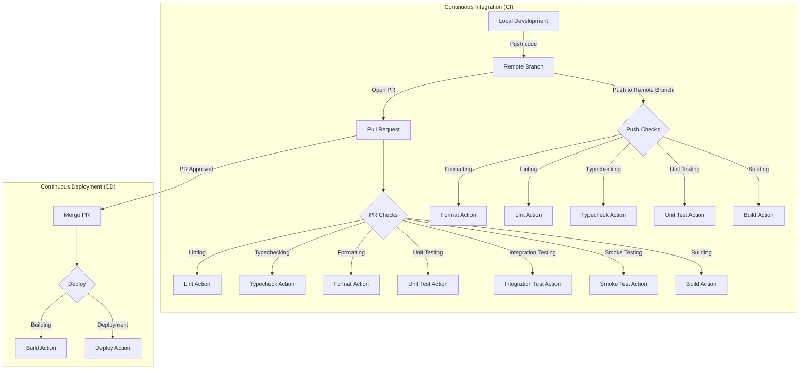

## Setup

### Build and run the project

```bash
$ docker compose build
```

### Run the project

```bash
$ docker compose up
```

## CI / CD

```mermaid
graph TD
    subgraph "Continuous Integration (CI)"
        A[Local Development] -->|Push code| B[Remote Branch]
        B -->|Open PR| C[Pull Request]
        C --> D{PR Checks}
        D -->|Linting| E[Lint Action]
        D -->|Typechecking| F[Typecheck Action]
        D -->|Formatting| G[Format Action]
        D -->|Unit Testing| H[Unit Test Action]
        D -->|Integration Testing| I[Integration Test Action]
        D -->|Smoke Testing| J[Smoke Test Action]
        D -->|Building| K[Build Action]
        B -->|Push to Remote Branch| P{Push Checks}
        P -->|Formatting| Q[Format Action]
        P -->|Linting| R[Lint Action]
        P -->|Typechecking| S[Typecheck Action]
        P -->|Unit Testing| T[Unit Test Action]
        P -->|Building| U[Build Action]
    end
    subgraph "Continuous Deployment (CD)"
        C -->|PR Approved| L[Merge PR]
        L --> M{Deploy}
        M -->|Building| N[Build Action]
        M -->|Deployment| O[Deploy Action]
    end
```
