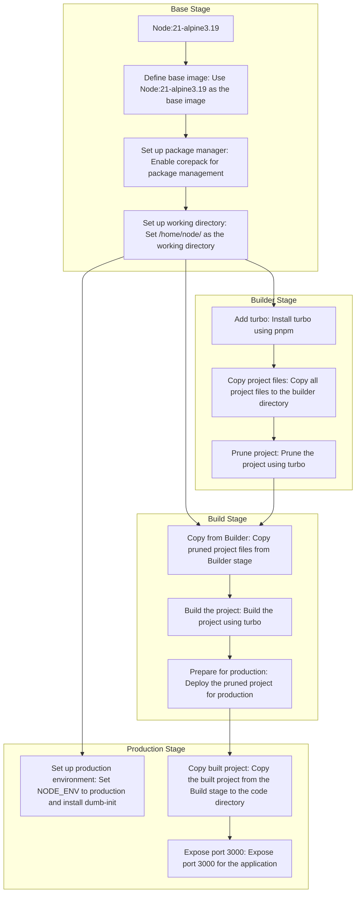

```mermaid
graph TB
	subgraph "Base Stage"
		A[Node:21-alpine3.19]
		A --> B1[Define base image: Use Node:21-alpine3.19 as the base image]
		B1 --> B2[Set up package manager: Enable corepack for package management]
		B2 --> B3[Set up working directory: Set /home/node/ as the working directory]
	end
	subgraph "Builder Stage"
		B3 --> C1[Add turbo: Install turbo using pnpm]
		C1 --> C2[Copy project files: Copy all project files to the builder directory]
		C2 --> C3[Prune project: Prune the project using turbo]
	end
	subgraph "Build Stage"
		B3 --> D1[Install dependencies: Install project dependencies using pnpm]
		C3 --> D1[Copy from Builder: Copy pruned project files from Builder stage]
		D1 --> D2[Build the project: Build the project using turbo]
		D2 --> D3[Prepare for production: Deploy the pruned project for production]
	end
	subgraph "Production Stage"
		B3 --> E1[Set up production environment: Set NODE_ENV to production and install dumb-init]
		D3 --> E2[Copy built project: Copy the built project from the Build stage to the code directory]
		E2 --> E3[Expose port 3000: Expose port 3000 for the application]
	end
```
