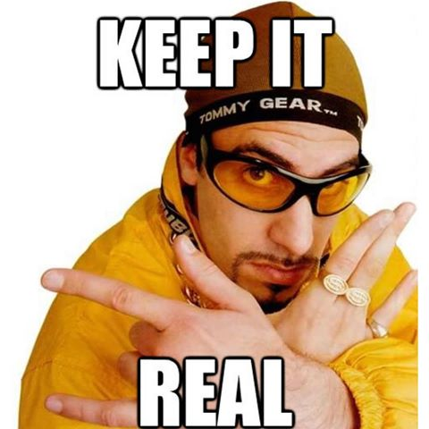

by [Quinnzel Kills](https://www.artstation.com/artwork/4kB9Y)

First and foremost, welcome, and thank you for stumbling on this page.

I can't imagine how this has happened, maybe it hasn't at all, and I'm just addressing myself as a future reader.
<---
Starting something from scratch is always a scary endeavor, even more so when talking about writing...
I'm trying to write down my thoughts and properly communicate them to my audience regarding what this platform is about, what purpose does it serve, who should care about it. Still, The fact is that I'm being assaulted by a white sheet of paper.
There are so many options on what to say and how to say it that I'm stuck in an endless loop of analysis paralysis.
--->

Before proceeding any further by publishing any content, I need to set the scene and manage the expectation.
I will try to do so with the tried and trusted rhetoric framework of the "Five Ws."
[Who What When Where Why How]

# What
I envision this as a personal space to explore the different subjects that fascinate me in software engineering.
Why should you care? After all,  the number of engineering blogs probably equals the number of engineers, so what about this one then?
The answer is that there is nothing special about this blog, and probably you should not care. I have built this platform with just one target audience in mind: Me.
That said, You are free to read it and use the material. If any of the content is of value to you, I am happy to have helped.

# Why
I can easily summarize it with Ali G's trade-mark idiom, "Keep it real !".

Making something public, available to scrutiny, force you to think harder about it in the first place. You become accountable for it.
This is precisely the situation that I want to force myself into for the following disparate reasons:
to gather all my content in a single place (code or thoughts), where I can keep it tidy
to follow through curiosity with actions
to remain honest with my statements
to explain what I have learned as straight forward as possible
to acknowledge and pay respect to all the people and thought leaders that have influenced me and helped me grow.

How?
I have a masterplan, he said!
To be honest, it is not a masterplan, but more or less a series of dots that I want to connect.
