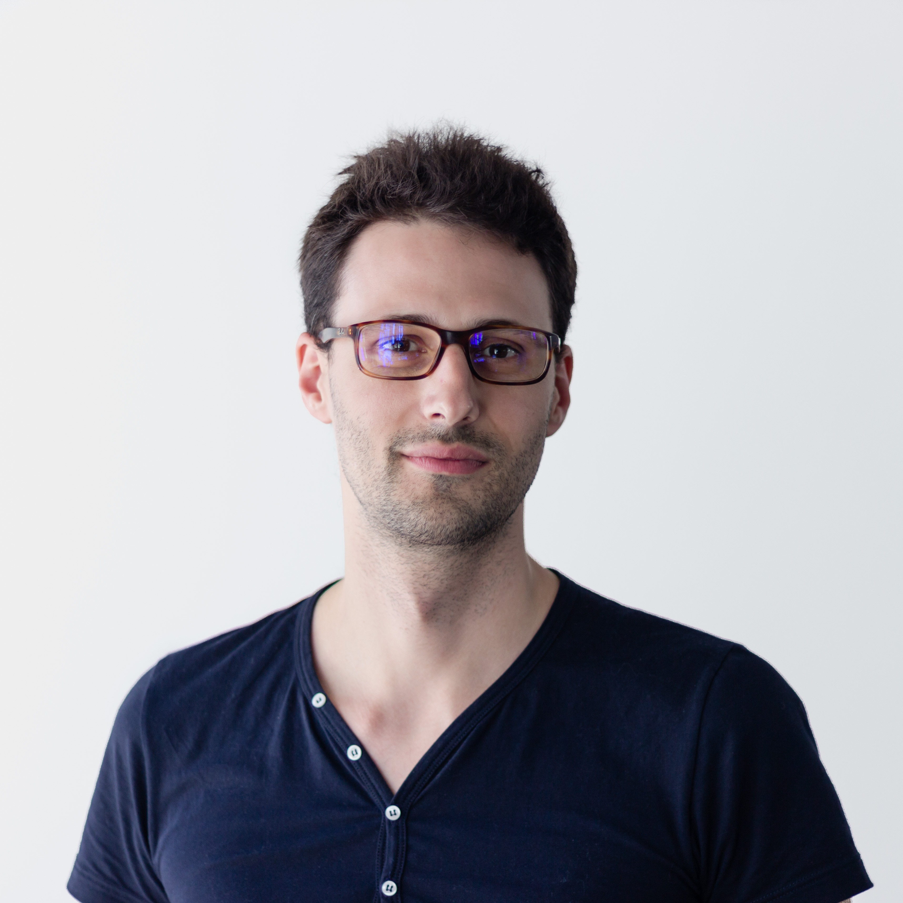

import config, { routesMap } from '../../config/index'
import { DateAndReadingTime, ReadLink, SEO } from '../components/index'

<SEO
  titleTemplate="About Me"
  description={'All about Giovanni Ravalico'}
  url={config.siteUrl + routesMap.getRoute('about-me').url}
/>

# Hi! I'm Giovanni 👋

<DateAndReadingTime date={new Date(2020, 7, 26)} timeToRead={2} />

I am a self-taught **software developer**, a geek, and more generally a problem solver. I am also a young father of two and a committed husband.

I was born in ☢️🌧 **1986** (you to do the math) and grew up in a small city by the 🌊 sea **in the north-east of 🇮🇹 Italy**.

At the university, I **📚 studied Modern History**, but I never actually graduated. There I **met the ❤️ love of my life**, 👱🏻‍♀️ Morena, with whom I have been together ever since.

Soon after college, we **got 💍 married and started** our own 👩‍❤️‍👨 **family**. In 2014 our hearts became soo much bigger when 👶🏻 Enea come about. Four years later, 👶🏻 Elai managed to have the same effect on us.

**Kids** are the **most amazing thing** that had happened to me. They **changed my life**. They **brought** so much **clarity**!

Thanks to this new perspective, in **2014**, I decided to **switch career** and transition toward 💻 software engineering.
That was the beginning of my unconventional journey toward becoming a software developer.
For any further information, please **refer to my <ReadLink to={routesMap.getRoute("resume").url}>📑 résumé</ReadLink>**.

I am an **incredibly 👀 curious** person by nature and a **life long learner**. **Reading**, **thinking**, and **testing** what I have learned **is one of my life's joy**. Programming has managed to scratch this itch for me ever since I picked it up.

**TypeScript** is my language of choice. It has shaped the way I think soo much soo that now I'm seeing types, signatures, and contracts flowing around even in dynamically typed languages.

**I'm language-curious**; my gaze is set on the **functional** side of the **language** spectrum with the end goal of, one day, picking up Haskell.

**I** try **not** to **concern** myself too much **with this** library **or that framework** since, as time has proven many times over, they tend to come and go as the hype wagon moves on to the next thing.

**Instead, I prefer to have a better understanding of the underlying building blocks**, which tend to be more stable: the language, the data structures, and the design patterns that enable the creation of higher levels of abstractions.

**Making stuff is really fulfilling for me**. **I just happened to choose to use code to do so**, but I could definitely see myself as a 🪓 carpenter, working with wood, or as a 🧑🏻‍🍳 chef preparing some elaborate recipe or...

I lived in 🇮🇹 Italy, 🇭🇷 Croatia, and 🇩🇪 Germany. Currently, **I'm located in Berlin, Germany**.

You can **find me on** [🐦 Twitter](https://twitter.com/suddenlyGio/), [🐙 GitHub](https://github.com/suddenlyGiovanni/) and [LinkedIn](https://www.linkedin.com/in/giovanni-ravalico/).

The best way to **reach me** is **by** dropping me an [✉️ **email**](mailto:ravalico.giovanni+suddenlygiovanni@gmail.com)

<ReadLink to={routesMap.getRoute('blog').url}>&larr; back to my Blog</ReadLink>
